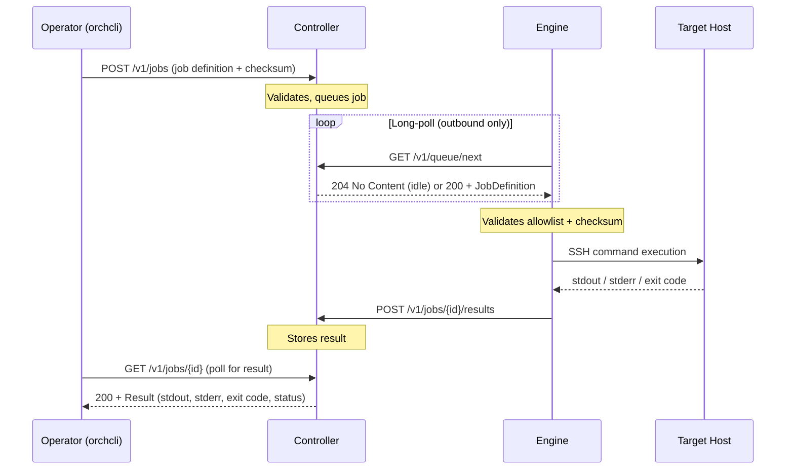

# Orchestration Engine

> Distributed task execution for restricted and PCI-segmented networks — built in Go.

[](https://go.dev/)
[](#license)
[](#architecture)
[](#)

---

## Overview

`orchestration_engine` is a lightweight distributed orchestration system designed for environments where inbound firewall rules are not an option. It enables secure, auditable remote command execution across segmented networks — including PCI DSS cardholder data environments — without requiring any inbound access to the engine or target hosts from a central controller.

The system is built around three standalone binaries that communicate over a simple HTTP API. Engines long-poll the controller for work, SSH into target hosts to execute commands, and report results back — all outbound. No agents. No inbound ports. No persistent connections.

---

## Why This Exists

In PCI-segmented or otherwise restricted environments, the standard model of a central controller pushing work *to* agents breaks down. Firewalls block inbound connections to segmented hosts. Opening those rules introduces risk and requires change-control overhead.

This system inverts the model:

- The **controller** sits in a reachable zone and exposes an HTTP API
- **Engines** live inside the restricted network and reach *out* to the controller
- **Target hosts** are only ever reached by the engine over SSH — locally, within the segment
- No port is ever opened on the restricted side to accept inbound traffic

This architecture also means job execution is auditable at every layer: the controller logs every submission, every pickup, and every result; the SSH executor validates command integrity via SHA-256 checksum before running anything.

---

## Architecture



### Component Overview

```
┌─────────────────────────────────────────────────────────┐
│                    UNRESTRICTED ZONE                    │
│                                                         │
│   ┌──────────┐       ┌──────────────────────────────┐   │
│   │ orchcli  │──────▸│         controller           │   │
│   └──────────┘       │                              │   │
│                      │  POST /v1/jobs               │   │
│                      │  GET  /v1/jobs/{id}          │   │
│                      │  GET  /v1/queue/next   ◂─┐   │   │
│                      │  POST /v1/jobs/{id}/results  │   │
│                      └──────────────────────────────┘   │
└─────────────────────────────────────────────────────────┘
                                                  │ outbound poll
┌─────────────────────────────────────────────────┼───────┐
│                   RESTRICTED ZONE               │       │
│                                                 │       │
│                              ┌──────────────────┘       │
│                              ▼                          │
│                        ┌──────────┐                     │
│                        │  engine  │                     │
│                        └────┬─────┘                     │
│                             │ SSH (outbound)            │
│                    ┌────────┴──────────┐                │
│                    ▼                   ▼                │
│              ┌──────────┐        ┌──────────┐           │
│              │  host-a  │        │  host-b  │           │
│              └──────────┘        └──────────┘           │
└─────────────────────────────────────────────────────────┘
```

---

## Components

### `controller`
The central coordination point. Exposes an HTTP API for job submission, status polling, and result ingestion. Maintains an in-memory FIFO queue protected by a mutex. Stateless across restarts — designed to be simple and transparent.

| Endpoint | Method | Description |
|---|---|---|
| `/v1/jobs` | `POST` | Submit a new job for execution |
| `/v1/jobs/{id}` | `GET` | Poll job status or retrieve result |
| `/v1/queue/next` | `GET` | Engine long-poll: dequeue the next pending job |
| `/v1/jobs/{id}/results` | `POST` | Engine posts execution result |

### `engine`
Runs inside the restricted network. Long-polls the controller for pending jobs, validates each job against a command allowlist and SHA-256 checksum, executes it over SSH, and posts the result back. Handles graceful shutdown on `SIGINT`/`SIGTERM`. Supports configurable dial timeouts, job timeouts, and host key fingerprint pinning.

### `orchcli`
An operator-facing CLI for submitting jobs. Reads a job definition from a JSON file, prompts interactively for credentials (password input is hidden), computes the command checksum, submits the job, and polls until a result is returned or an error occurs.

---

## Getting Started

### Prerequisites

- Go 1.24+
- SSH access to target hosts from wherever the engine will run
- Network path from the engine to the controller HTTP API (outbound only)

### Build

```bash
git clone https://github.com/Jeremiahtaylor2017/orchestration_engine.git
cd orchestration_engine

# Build all three binaries
go build -o bin/controller ./cmd/controller
go build -o bin/engine     ./cmd/engine
go build -o bin/orchcli    ./cmd/orchcli
```

Pre-built binaries are available in `bin/` for reference.

### Configure the Engine

Copy the example config and adjust for your environment:

```bash
cp config.example/engine.yaml config/engine.yaml
```

```yaml
# config/engine.yaml
transport:
  controller_url: http://<controller-host>:8080
  poll_interval_seconds: 5
  http_timeout_seconds: 30

execution:
  # If set, only these commands can be dispatched. Omit to allow any command.
  allowed_commands:
    - /usr/bin/bash
    - /usr/bin/whoami

  dial_timeout_seconds: 10
  job_timeout_seconds: 120

  # Optional: pin expected host key fingerprints per host or host:port
  host_key_fingerprints:
    192.168.1.100: "SHA256:abc123..."
    192.168.1.101:2222: "SHA256:def456..."
```

### Run

```bash
# Start the controller (defaults to :8080)
./bin/controller --listen :8080

# Start the engine (inside the restricted network)
./bin/engine --config config/engine.yaml
```

---

## Submitting a Job

### 1. Create a job definition

```json
{
  "target_host": "192.168.1.100",
  "target_port": 22,
  "command": "/usr/bin/whoami"
}
```

### 2. Submit via `orchcli`

```bash
./bin/orchcli --job job.json --controller http://localhost:8080
```

`orchcli` will:
1. Generate a unique job ID if one is not provided
2. Prompt you to confirm the target user
3. Prompt for SSH credentials 
4. Compute the SHA-256 checksum of the command
5. Submit the job and poll for the result

**Example output:**

```
Target user []: admin
Admin username: admin
Admin password:
2025/11/14 00:01:23 job 4f3a1b... queued; waiting for result...
2025/11/14 00:01:25 job 4f3a1b... status=running
2025/11/14 00:01:26 job 4f3a1b... finished status=succeeded exit=0
----- stdout -----
admin
```

---

## Job Definition Reference

| Field | Type | Required | Description |
|---|---|---|---|
| `id` | string | No | Job identifier. Auto-generated if omitted. |
| `target_host` | string | Yes | Hostname or IP of the target |
| `target_port` | int | No | SSH port. Defaults to `22`. |
| `target_user` | string | No | SSH username. `orchcli` prompts if omitted. |
| `command` | string | Yes | Command to execute on the target host |
| `arguments` | []string | No | Arguments passed to the command |
| `allow_tty` | bool | No | Request a pseudo-terminal (for interactive commands) |
| `checksum` | string | No | SHA-256 of the command. Computed by `orchcli` automatically. |
| `metadata` | object | No | Arbitrary key-value pairs passed through to the result |

---

## Security Controls

| Control | Implementation |
|---|---|
| **Outbound-only communication** | Engines initiate all connections. No inbound rules required on the restricted network. |
| **Command allowlist** | The engine can be configured with a fixed set of permitted commands. Jobs specifying anything outside the list are rejected before execution. |
| **Command integrity (SHA-256)** | `orchcli` computes a checksum of the command at submission. The engine recomputes and verifies it before running — preventing tampering in transit. |
| **Host key pinning** | Expected SSH host key fingerprints can be pinned per host in `engine.yaml`. Mismatches abort the connection. |
| **Credential isolation** | Credentials are provided per job at runtime and never stored by the controller or engine. |
| **No echoed secrets** | `orchcli` uses `golang.org/x/term` to read passwords without printing them to the terminal. |
| **Context-bound execution** | Every job runs under a Go context with a configurable timeout. Hung remote commands are cancelled — not left dangling. |
| **Graceful shutdown** | The engine handles `SIGINT`/`SIGTERM`, draining in-progress work cleanly before exit. |

---

## Transport Modes

The engine supports two transport backends, selectable at compile/config time:

### HTTP Transport (default)
The engine long-polls the controller's REST API. Suitable for networked environments where the engine has outbound HTTP access to the controller.

### Filesystem Transport
The engine watches a shared inbox directory for `*.job.json` files. Suitable for air-gapped environments or scenarios where a shared volume is available. Results are written next to the job file as `*.job.json.result.json`.

---

## Project Structure

```
orchestration_engine/
├── cmd/
│   ├── controller/     # Controller HTTP API server
│   ├── engine/         # Engine poll-execute-report loop
│   └── orchcli/        # Operator CLI for job submission
├── pkg/
│   ├── controller/     # In-memory job store (queue + results)
│   ├── executor/       # SSH executor with allowlist + checksum validation
│   ├── jobs/           # Shared types: JobDefinition, Result, Status
│   └── transport/      # HTTP and filesystem transport backends
├── config.example/
│   └── engine.yaml     # Annotated reference configuration
└── bin/                # Pre-built binaries
```

---

## Author

**Jeremiah Taylor** — Security Engineer
[GitHub](https://github.com/Jeremiahtaylor2017) · [LinkedIn](https://www.linkedin.com/in/jeremiahtaylor2017/)
